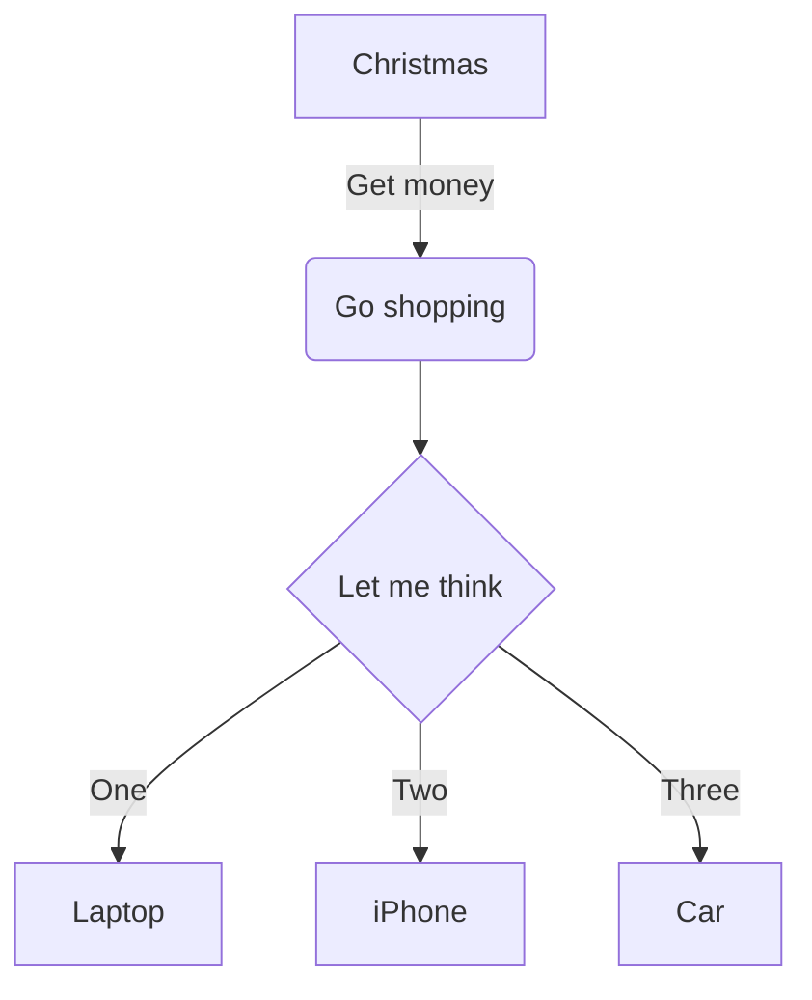

# markup-mermaid-inline

## sources

```txt sources
# from here
https://github.com/mermaidjs/mermaid.cli
```

## install yarn

```bash install_yarn
sudo pacman -Syy yarn
```

## install mermaid cli

```bash install
# install local
yarn add mermaid.cli
```

## add node_modules to .gitignore

```bash add_node_modules_to_gitignore
echo "node_modules" >>.gitignore
```

## call mermaid as local install

```bash call mermaid
./node_modules/.bin/mmdc -h
```

## set alias in the session avoid global installation

```bash set_alias
# set alias
alias mermaid="$PWD/node_modules/.bin/mmdc"

# test alias
mermaid -h
```

## mermaid test



## mermaid test1


