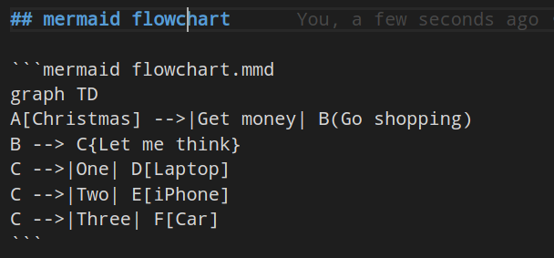

# markup-mermaid-inline

## TL;DR

- create a new markdown file
- convert inline mermaid block in markdown to images
- add link to the new generated images

### Pro

- edit mermaid direct in markdown file
- publish the file direct on git*

### Contra

- one step more in your pipeline

## RUN

```bash
# install yarn
sudo pacman -Syy yarn
yarn install

# install mermaid
yarn add mermaid.cli

# run init sample
./inline_mermaid.sh -f --input README.md

# read messages for find output :)
```

## mermaid block



## run test

- install bats

```bash
git clone https://github.com/bats-core/bats-core.git
cd bats-core
./install.sh /usr/local

# run test
bats test/02_markdown_mermaid_inline.bats
```

## run coverage

```bash
# install bashcov
gem install bashcov

# set alias for bashcov
alias bashcov="~/.gem/ruby/2.6.0/bin/bashcov"

# run test under coverage
bashcov --skip-uncovered test_bashcov.sh

# show output in chrome
chromium ./coverage/index.html

# reset coverage statistic
rm -rf coverage

```

## sources

```txt sources
# from here
https://github.com/mermaidjs/mermaid.cli
https://github.com/bats-core/bats-core
https://github.com/infertux/bashcov

```

## add node_modules to .gitignore

```bash add_node_modules_to_gitignore
echo "node_modules" >>.gitignore
```

## call mermaid as local install

```bash call mermaid
./node_modules/.bin/mmdc -h
```

## set alias in the session avoid global installation

```bash set_alias
# set alias
alias mermaid="$PWD/node_modules/.bin/mmdc"

# test alias
mermaid -h
```

## markdown mermaid block


## mermaid test1


