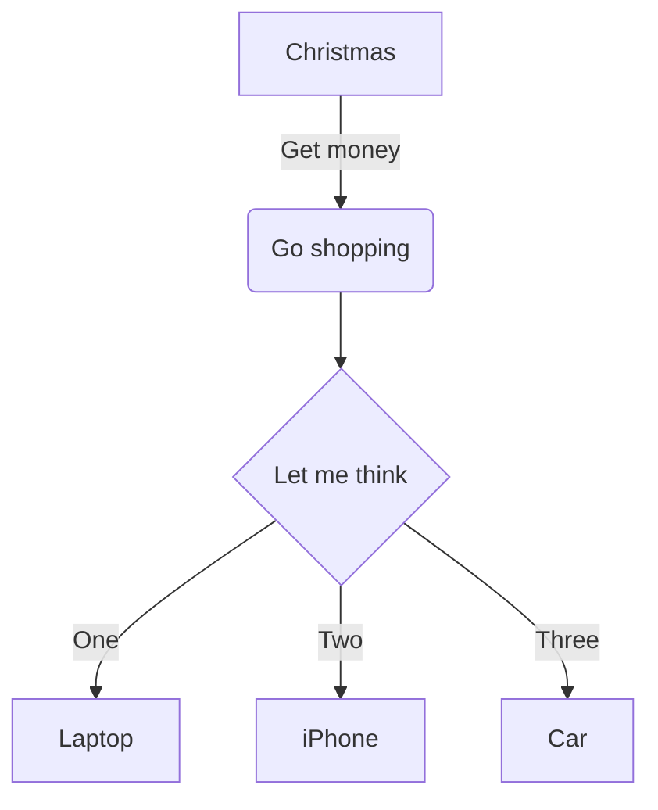

# mermaid

- test double flowchart name

## mermaid test



## test mermaid block without flavor

```
graph TD
A[Christmas] -->|Get money| B(Go shopping)
B --> C{Let me think}
C -->|One| D[Laptop]
C -->|Two| E[iPhone]
C -->|Three| F[Car]
```
